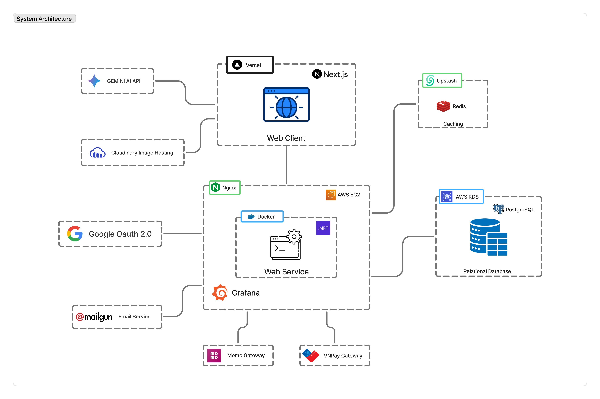
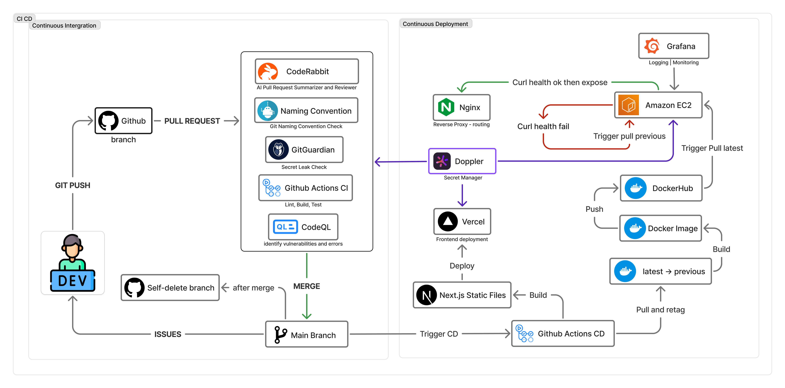

# [GenCare](https://www.gencare.site/)

[](https://github.com/hatohui/GenCare/actions/workflows/backend-cd.yaml) [](https://github.com/hatohui/GenCare/actions/workflows/frontend-cd.yaml)

## [Documentations](https://docs.google.com/document/d/1XjSV5tjIUnbtGK0gRnviHctuyyV1d5tSxzv_fKDsAdA/edit?tab=t.0#heading=h.c2t5i58dg7of)

GenCare is a comprehensive web-based management system designed for healthcare facilities offering gender-specific and sexual health services. It supports a wide range of functionalities, from reproductive health tracking to STI testing and consultation scheduling.

## Project Information

### 💻 Tech Stack

#### 🖥️ Frontend


#### 🧠 Backend


#### 🛢️ Database & Cache


#### 🚀 DevOps


#### ⚙️ Dev Tools


#### System Architecture

<p align="center">
  
  System Architecture Diagram
</p>

#### Continuous Integration & Continuous Delivery

<p align="center">
  
  Continuous Integration & Continuous Delivery
</p>

#### Database ERD

<p align="center">
  
  Database ERD
</p>

## Development

### Getting started:

#### 1. Set up environment:

Clone this repository, then clone `.env.example` to `.env` and populate with necessary information. The API keys will be added in later, check the group.

<p align="center">
  
</p>

##

#### 2. Install Docker

Go to [Docker Desktop](https://www.docker.com/products/docker-desktop) and install Docker.

After installation completed. Create a personal account and login until you can see the `Containers` page.

<p align="center">
  
</p>

_p/s: Leave docker open when you're developing with docker containers._

#### 3. Development

Open the command line for the directory by pressing **Ctrl + `**

For backend:

```
cd backend
```

For frontend:

```
cd frontend
```

Then run:

```
docker-compose -f .\docker-compose.dev.yaml up
```

Example:

<p align="center">  
  
</p>

to start up the development server.

_Notes:_

- **Backend:**  
  The backend API is available at [http://localhost:8080/swagger/index.html](http://localhost:8080/swagger/index.html).

- **Frontend:**  
  The web application runs at [http://localhost:3000/](http://localhost:3000/).

- **Database:**  
  The PostgreSQL database is exposed on port `5432`.  
  Use the credentials from `.env.example` to connect via your preferred database viewer (e.g., Microsoft SQL Server Management Studio) in the development environment.

---

### Committing to the project

#### 1. Creating/Assigning an Issue

Before starting work on a new feature or bug fix, create an issue in the repository to track the task. If an issue already exists, assign it to yourself.

**Steps:**

1. Go to the repository's "Issues" tab.
2. Click **New Issue** to create a new one, or select an existing issue relevant to your work.
3. Provide a clear title and description outlining the feature, bug, or task.
4. Assign the issue to yourself or the appropriate team member.

This ensures all work is tracked, discussed, and linked to commits and pull requests for better project management.

##### Issue Naming Convention

When creating issues, use the following naming convention:

```
[FE | related-feature] concise issue description
[BE | related-feature] concise issue description
```

- Use `[FE | ...]` for frontend issues and `[BE | ...]` for backend issues.
- Replace `related-feature` with the relevant feature or context (e.g., `Auth`, `Dashboard`).
- Write a short, clear description of the issue after the prefix.

<div align="center">

| Issue Title                                 | Valid? |
| ------------------------------------------- | :----: |
| `[FE \| Auth] implement login page`         |   ✅   |
| `[BE \| user-management] fix user deletion` |   ✅   |
| `[FE \| Dashboard] add analytics widget`    |   ✅   |

Tb-0. example of valid issue titles.

</div>

**Examples:**

<div align="center">
  
  image of a valid issue.
</div>

---

#### 2. Branching

- **Create a new branch for each feature:**  
  Start every new branch from `main`, focusing on a single feature or fix.

- **Merging workflow:**  
  When your feature is complete, open a Pull Request (PR) to merge your branch into `main` for deployment.

- **Feature branch collaboration:**  
  If collaborating on a feature, create additional branches from the feature branch and use PRs to merge changes back into it.

---

##### Branch Naming Convention

Branch names must follow this pattern:

<div align="center">

```
^(main$|(feature|fix|task)\/.+(?:-.*)?)$
```

</div>

Start branch names with `feature/`, `fix/`, or `task/`.

<div align="center">

| Branch Name            | Valid? |
| ---------------------- | :----: |
| `feature/login-page`   |   ✅   |
| `fix/crash-on-startup` |   ✅   |
| `task/update-readme`   |   ✅   |
| `feature-login-page`   |   ❌   |
| `feature/`             |   ❌   |
| `feature/login page`   |   ❌   |

Tb-1. example of valid branch names.

</div>

---

#### 3. Commiting

##### Commits Naming Convention:

Commit messages must follow this pattern:

<div align="center">

```
^(fix|feat|chore): .+$
```

</div>

- **Type:** Start with `fix:`, `feat:`, or `chore:` to indicate the nature of the change.
  - `fix:` for bug fixes
  - `feat:` for new features
  - `chore:` for maintenance or non-functional changes
- **Message:** After the type, add a concise description of the change.

<div align="center">

| Commit Message                 | Valid? |
| ------------------------------ | :----: |
| `feat: add login form`         |   ✅   |
| `fix: resolve endpoint bug`    |   ✅   |
| `chore: update dependencies`   |   ✅   |
| `feature: implement JWT login` |   ❌   |
| `fix login bug`                |   ❌   |

Tb-2. example of valid commit messages.

</div>

##

#### 4. Pull Requests

##### Pull Request Title Convention

Pull Request (PR) titles must follow this pattern:

<div align="center">

```
^\[(FE|BE)(\s*\|\s*[a-zA-Z0-9-_]+)?\]\s+[a-zA-Z].+
```

</div>

- Start with `[FE | feature]` or `[BE | feature]` (the `| feature` part is optional, but recommended for clarity).
- Use `FE` for frontend and `BE` for backend.
- After the prefix, add a concise description of the PR, starting with a letter (uppercase or lowercase).

<div align="center">

| PR Title                                 | Valid? |
| ---------------------------------------- | :----: |
| `[FE \| auth] Add login page`            |   ✅   |
| `[BE \| user-management] Fix user roles` |   ✅   |
| `[FE] Update dashboard layout`           |   ✅   |
| `[BE] Implement API endpoint`            |   ✅   |
| `[FE \| ] Add tests`                     |   ✅   |
| `[FE]add login page`                     |   ✅   |
| `[FE \| auth] add Login Page`            |   ✅   |
| `add login page`                         |   ❌   |

Tb-3. example of valid PR titles.

</div>

#### Commit & Pull Request Descriptions:

- **Commit Description:**  
  Clearly describe what changed in the commit. Include a brief summary of the new feature, bug fix, or technical change. Focus on what was modified, added, or removed.

  Special: include ``#skip` in the `commit message` to skip deployment

- **Pull Request Description:**  
  The PR description should include the commit description and reference the related issue using one of the following keywords:

  - `close`
  - `closes`
  - `closed`
  - `fix`
  - `fixes`
  - `fixed`
  - `resolve`
  - `resolves`
  - `resolved`

  Tag the issue by adding `#<issue_tag>` immediately after the keyword. If no related issue exists, create one before submitting the PR. For routine tasks (e.g., updating from `main`), tagging is optional.

**Example:**

```
[FE] add password reset functionality

- Implemented password reset form and API integration.
- Updated user authentication flow to support password resets.

closes #42
```

##

### Repository Rules

1. `main` is a protected branch, and is the production branch of this project, all commits made to it will be deployed via CI/CD, you can only do `Pull request` into it.

2. All `branches` & `commits` aside from `main` must follow a set naming convention.

3. All `commits` to a `feature` branch must be made through a `Pull Request`

4. At least `1` review is required for successful `PR`.

5. The code must pass the security check done by `CodeQL` and `GitGuardian`.

#### Project Credits

<div align="center">

| No  | Student ID |        Name         | Github URL                                    |
| --- | ---------- | :-----------------: | --------------------------------------------- |
| 1   | `SE182425` | `Hồng Lê Đăng Khoa` | [NicolaiHong](https://github.com/NicolaiHong) |
| 2   | `SE182742` | `Nguyễn Tiến Phát`  | [NTPhat0322](https://github.com/NTPhat0322)   |
| 3   | `SE190797` |    `Lê Sỹ Tuyền`    | [hatohui](https://github.com/hatohui)         |
| 4   | `SE190051` |   `Phạm Anh Kiệt`   | [KietPham-VN](https://github.com/KietPham-VN) |
| 5   | `SE193759` |   `Đinh Gia Huy`    | [HuyDG160205](https://github.com/HuyDG160205) |

## </div>

<div align="center">

### 🙏 Thank You for Being Part of GenCare!

</div>

We appreciate your contributions and dedication to the GenCare project.

- For questions or suggestions, please communicate within the project team or use the repository's [issue tracker](../../issues).
- **Note:** External contributions are not accepted, as this is a closed group project.

<div align="center">

Let's build something great together! 🚀

</div>
